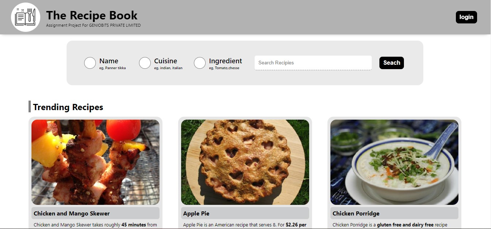

# The Recipe Book

This is a Recipe Book MERN Stack Project developed for Geniobits Pvt Ltd Assgnment

## Over View of Webpage
 This is a recipe book where users can ciew, search, and save recipes.

## Tech Slacks

- HTML
- CSS
- JavaScript
- React
- Node.js
- MongoDB, Mongoose
- Redux Toolkit
- JWT
- Express

 

## Deployment
 
### TheRecipeBook (Demo)
[Click here to visit](https://therecipebook.onrender.com/)

## Features
- User Authentication (Login / Signup / Logout)
- Recipe Catalog: A list of recipes with their details (name, ingredients, instructions, and image).
- Recipe Search: Users can search for recipes based on different criteria (name, ingredient, cuisine, etc.).
- Recipe Saving: Users can save recipes to their personal recipe book and view their saved recipes.
- Recipe Details: Users can view the details of a recipe, including its ingredients, instructions, and image.
- User Profile: Users can view their profile, which should include their saved recipes

## Authors
# Hi, I'm Vikas Harge! 👋
- [@Vikas_Harge](https://github.com/VikasHarge)

## 🚀 About Me
I'm a full stack developer...

## 🛠 Skills
React, Javascript, HTML, CSS, MongoDB, Express.js

